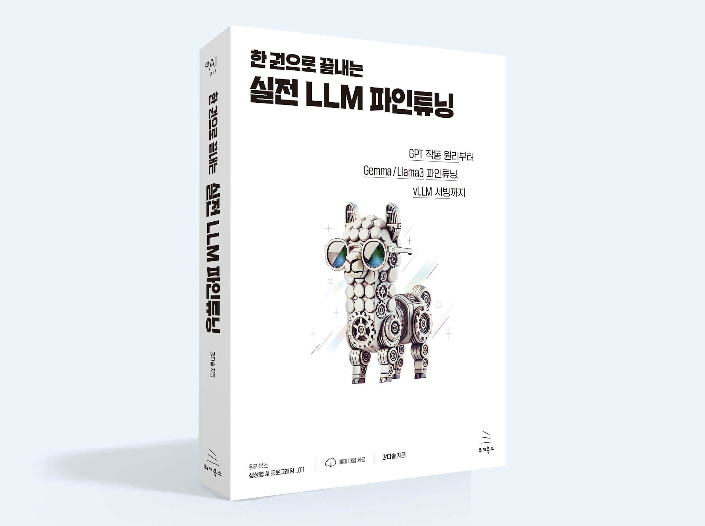

# 한 권으로 끝내는 LLM 실전

## 📚 도서 소개

이 책은 LLM(Large Language Model)의 **역사부터 최신 기술까지** 모든 것을 다룹니다: NLP의 역사적 배경부터 실전에서 바로 활용할 수 있는 다양한 튜닝 기법(Full-Fine Tuning, Lora Tuning, QLora Tuning)과 vLLM 서빙 방법까지, LLM 전문가가 되기 위한 모든 내용을 담았습니다.

### 🌟 특징
- NLP와 인공지능의 역사적 맥락 이해
- GPT 모델의 원리와 구현 상세 분석
- Gemma2, Llama3.1 등 최신 모델 실전 활용
- 단일/다중 GPU 환경의 효율적 학습 방법
- PEFT를 활용한 경량화 튜닝 기법
- vLLM 기반 고성능 서빙 구축

## 📋 상세 커리큘럼

### 📖 Part 1: NLP의 과거와 오늘
- 초기 기계 번역부터 현대 NLP까지의 여정
- 튜링 테스트: 생각의 전환점
- 퍼셉트론: 인공지능 학습의 첫걸음
- 비선형성과 인공지능의 발전
- 역전파 알고리즘의 수학적 이해와 구현
- 언어 모델의 발전 과정과 트랜스포머의 등장

### 🔧 Part 2: GPT 구현하기
- Runpod 환경 세팅
- GPT 구현 및 실습 
- 커스텀 토크나이저 제작

### 🚀 Part 3: 실전 파인튜닝
- Full Fine-tuning의 원리와 실전 테크닉
- GPU 병렬화 전략 (DP, MP, PP, TP, FSDP)
- Gemma-2B-it과 Llama3.1-8B-instruct 실습
- Wandb를 활용한 실험 관리

### ⚡ Part 4: PEFT 최적화
- LoRA와 QLoRA 이론과 실습
- 양자화 기법과 정밀도 분석
- OpenAI를 활용한 성능 평가

### 🌐 Part 5: 모델 서빙
- Paged Attention 메커니즘 원리
- vLLM 기반 추론 최적화
- Multi-LoRA 실전 활용

## 🎯 실습 환경
- Runpod GPU 클라우드
- PyTorch / Transformers
- Weights & Biases
- vLLM

## 🤝 커뮤니티

궁금한 점이 있으신가요? 다음 채널에서 소통하실 수 있습니다:

- [카카오 오픈채팅방](https://open.kakao.com/o/gO7Y1YMg)

---

Made with ❤️ by [Kang Da Sol]

